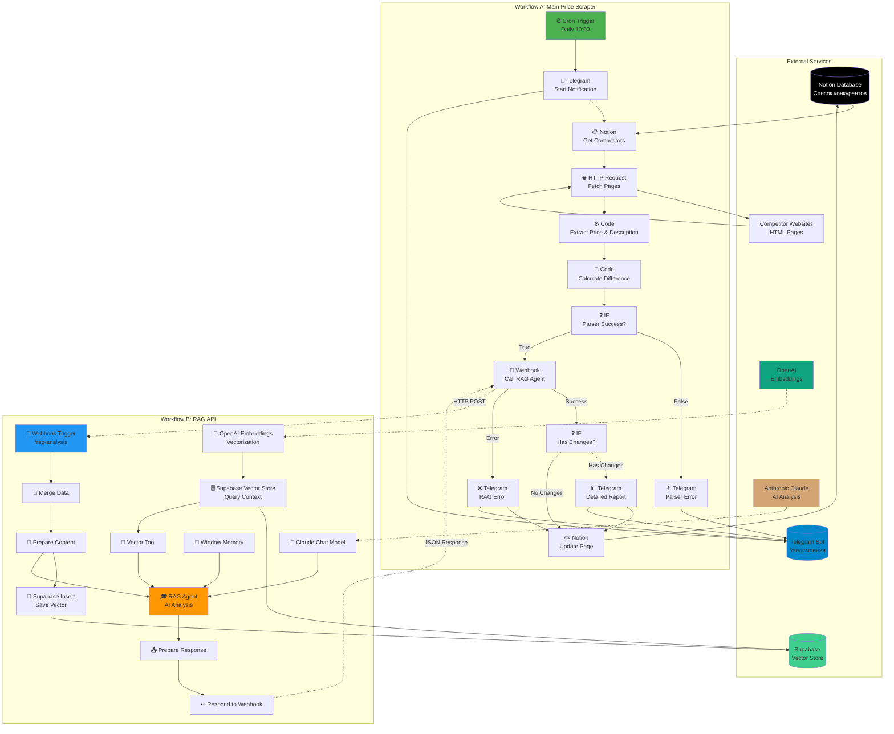

# Архитектура Системы Мониторинга Цен

## Обзор

Система состоит из двух взаимосвязанных n8n воркфлоу, которые вместе образуют интеллектуальный агент с использованием RAG (Retrieval-Augmented Generation) для анализа изменений цен конкурентов.

---

## Диаграмма Архитектуры



---

## Поток Данных

### 1. Инициация (Workflow A)

```
┌─────────────┐
│ Cron Trigger│ Ежедневно в 10:00
└──────┬──────┘
       │
       ▼
┌─────────────────────┐
│ Telegram Notification│ "✅ Мониторинг запущен"
└──────────┬──────────┘
           │
           ▼
```

### 2. Сбор Данных (Workflow A)

```
┌──────────────┐
│ Notion Query │ Получить список конкурентов
└──────┬───────┘
       │
       ▼
┌──────────────────┐
│ For Each Competitor │
│  ┌──────────────┐│
│  │ HTTP Request ││ Загрузить HTML
│  └──────┬───────┘│
│         │        │
│         ▼        │
│  ┌──────────────┐│
│  │ cheerio Parse││ Извлечь цену + описание
│  └──────┬───────┘│
│         │        │
│         ▼        │
│  ┌──────────────┐│
│  │ Calculate Δ  ││ Разница и процент
│  └──────────────┘│
└───────────────────┘
```

### 3. AI Анализ (Workflow B через Webhook)

```
Workflow A                    Workflow B
    │                             │
    │  ┌──────────────────┐      │
    ├─>│ HTTP POST Request│──────┤
    │  │ to RAG Webhook   │      │
    │  └──────────────────┘      │
    │                             ▼
    │                    ┌─────────────────┐
    │                    │ Receive Data    │
    │                    └────────┬────────┘
    │                             │
    │                    ┌────────▼────────┐
    │                    │ Vectorize       │
    │                    │ (OpenAI)        │
    │                    └────────┬────────┘
    │                             │
    │                    ┌────────▼─────────┐
    │                    │ Save to Supabase │
    │                    └──────────────────┘
    │                             │
    │                    ┌────────▼────────┐
    │                    │ Query Context   │
    │                    │ (Vector Search) │
    │                    └────────┬────────┘
    │                             │
    │                    ┌────────▼────────┐
    │                    │ RAG Agent       │
    │                    │ (Claude +       │
    │                    │  History)       │
    │                    └────────┬────────┘
    │                             │
    │  ┌──────────────────┐      │
    │<─│ JSON Response    │──────┤
    │  │ with Analysis    │      │
    │  └──────────────────┘      │
    ▼
```

### 4. Принятие Решения (Workflow A)

```
┌─────────────────┐
│ Analyze Response│
└────────┬────────┘
         │
    ┌────▼────┐
    │Contains │
    │"БЕЗ     │
    │ИЗМЕНЕНИЙ"?
    └────┬────┘
         │
    ┌────┴─────┐
    │          │
    ▼          ▼
  YES         NO
    │          │
    │     ┌────▼──────┐
    │     │Send Telegram│
    │     │Report with│
    │     │AI Analysis│
    │     └───────────┘
    │          │
    └────┬─────┘
         │
         ▼
┌────────────────┐
│Update Notion DB│
└────────────────┘
```

---

## Компоненты и Технологии

### Workflow A: Main Scraper

| Компонент | Технология | Назначение |
|-----------|-----------|------------|
| **Триггер** | n8n Cron | Запуск по расписанию |
| **Источник данных** | Notion API | Список конкурентов |
| **Парсинг** | HTTP + cheerio | Извлечение данных с сайтов |
| **Обработка** | JavaScript (Code node) | Расчеты и трансформации |
| **Логика** | IF nodes | Условные переходы |
| **Уведомления** | Telegram Bot API | Отчеты и ошибки |
| **Хранение** | Notion API | Обновление результатов |

### Workflow B: RAG API

| Компонент | Технология | Назначение |
|-----------|-----------|------------|
| **Интерфейс** | Webhook | REST API endpoint |
| **Векторизация** | OpenAI text-embedding-3-small | Создание эмбеддингов |
| **Хранилище** | Supabase Vector Store | Векторная БД |
| **Поиск** | Cosine Similarity | Поиск похожих записей |
| **AI Модель** | Anthropic Claude 3.5 Sonnet | Анализ и генерация текста |
| **Память** | Window Buffer Memory | Контекст разговора |
| **Оркестрация** | LangChain Agent | RAG пайплайн |

---

## Потоки Ошибок

### Ошибка Парсинга

```
┌──────────────┐
│ HTML Request │
└──────┬───────┘
       │
       ▼
┌──────────────┐
│ Parse Failed │ (цена = null)
└──────┬───────┘
       │
       ▼
┌──────────────────┐
│ Set parserError  │
│ = true           │
└──────┬───────────┘
       │
       ▼
┌──────────────────────┐
│ IF Parser Success?   │
│      ❌ False        │
└──────┬───────────────┘
       │
       ▼
┌──────────────────────┐
│ Telegram Parser Error│
│ "⚠️ Не удалось       │
│  извлечь данные"     │
└──────────────────────┘
```

### Ошибка RAG Agent

```
┌──────────────────┐
│ Webhook to RAG   │
└──────┬───────────┘
       │
       ▼
┌──────────────────┐
│ Timeout / Error  │
└──────┬───────────┘
       │
       ▼
┌──────────────────┐
│ On Error Branch  │
└──────┬───────────┘
       │
       ▼
┌──────────────────────┐
│ Telegram RAG Error   │
│ "❌ RAG недоступен"  │
└──────┬───────────────┘
       │
       ▼
┌──────────────────┐
│ Continue without │
│ AI analysis      │
└──────────────────┘
```

---

## Безопасность и Best Practices

### Credentials Management

```
┌─────────────────────────────────────┐
│           n8n Credentials           │
├─────────────────────────────────────┤
│ ✓ Encrypted at rest                 │
│ ✓ Never exposed in logs             │
│ ✓ Separate for each service         │
│ ✓ Can be shared across workflows    │
└─────────────────────────────────────┘
         │
         ├─► Notion API (Integration Token)
         ├─► Supabase API (Service Role Key)
         ├─► Anthropic API (API Key)
         ├─► OpenAI API (API Key)
         └─► Telegram API (Bot Token)
```

### Environment Variables

```
Production:           Development:
┌──────────────┐     ┌──────────────┐
│ n8n UI       │     │ .env file    │
│ Environment  │     │ (local only) │
│ Variables    │     │              │
└──────────────┘     └──────────────┘
       │                    │
       └────────┬───────────┘
                │
         ┌──────▼──────┐
         │ $env.VAR    │
         │ in nodes    │
         └─────────────┘
```

### Rate Limiting

```
HTTP Requests
    │
    ├─► Max Retries: 3
    ├─► Timeout: 30s
    ├─► Retry Delay: Exponential Backoff
    └─► User-Agent: Custom (optional)

AI APIs
    │
    ├─► OpenAI: 3,500 RPM (free tier)
    ├─► Anthropic: 1,000 RPM (free tier)
    └─► Requests batched per competitor
```

---

## Масштабирование

### Текущая Конфигурация
- **Конкурентов:** 10-50
- **Проверок/день:** 1
- **Стоимость/месяц:** ~$0.10-$0.50

### Для 100+ конкурентов

1. **Увеличить параллелизм:**
   ```javascript
   // В Code node
   const batches = chunk(competitors, 10);
   for (const batch of batches) {
     await Promise.all(batch.map(checkCompetitor));
   }
   ```

2. **Оптимизировать векторное хранилище:**
   ```sql
   -- Использовать HNSW индекс вместо IVFFlat
   CREATE INDEX ON competitor_prices 
   USING hnsw (embedding vector_cosine_ops);
   ```

3. **Кэширование:**
   - Добавить Redis для кэширования HTML
   - TTL: 1 час

---

## Мониторинг

### Метрики для отслеживания

1. **Успешность выполнения:**
   - % успешных парсингов
   - % успешных RAG запросов
   - Время выполнения

2. **Качество данных:**
   - Количество обнаруженных изменений
   - Точность извлечения цен
   - Качество AI анализа

3. **Затраты:**
   - API calls к OpenAI
   - API calls к Anthropic
   - Размер Supabase БД

### Логирование

```
n8n Executions:
    ├─► Автоматическое логирование всех запусков
    ├─► Сохранение входных/выходных данных
    ├─► История ошибок
    └─► Retention: 30 дней (configurable)

Telegram:
    └─► Real-time notifications для критичных событий
```

---

## Расширения и Улучшения

### Возможные доработки:

1. **Мультиязычность:**
   - Определение языка сайта
   - AI анализ на разных языках

2. **Графики и визуализация:**
   - Интеграция с Grafana
   - Дашборд в Notion

3. **Умные уведомления:**
   - Разные каналы для разных приоритетов
   - Группировка изменений

4. **Расширенный парсинг:**
   - Поддержка SPA (Selenium/Playwright)
   - Обход CAPTCHA
   - Proxy rotation

5. **Предиктивная аналитика:**
   - Прогнозирование изменений цен
   - Рекомендации по ценообразованию

---

## Итоговая Схема Взаимодействия

```
┌─────────────────────────────────────────────────────────────┐
│                    DAILY EXECUTION (10:00)                  │
└─────────────────────────────────────────────────────────────┘
                              │
                              ▼
         ┌────────────────────────────────────┐
         │      Workflow A: Main Scraper      │
         │  ┌──────────────────────────────┐  │
         │  │ 1. Fetch from Notion         │  │
         │  │ 2. Scrape competitor sites   │  │
         │  │ 3. Extract & calculate       │  │
         │  │ 4. Call RAG API ──────────┐  │  │
         │  │ 5. Receive analysis       │  │  │
         │  │ 6. Send Telegram          │  │  │
         │  │ 7. Update Notion          │  │  │
         │  └──────────────────────────────┘  │
         └────────────────────────────────────┘
                              │ HTTP POST
                              ▼
         ┌────────────────────────────────────┐
         │       Workflow B: RAG API          │
         │  ┌──────────────────────────────┐  │
         │  │ 1. Receive data (webhook)    │  │
         │  │ 2. Vectorize (OpenAI)        │  │
         │  │ 3. Store in Supabase         │  │
         │  │ 4. Query historical context  │  │
         │  │ 5. Analyze with Claude       │  │
         │  │ 6. Return JSON response      │  │
         │  └──────────────────────────────┘  │
         └────────────────────────────────────┘
                              │
                              ▼
         ┌────────────────────────────────────┐
         │         Persistent Storage         │
         │  ┌──────────────────────────────┐  │
         │  │ Notion: Business Data        │  │
         │  │ Supabase: Vector Embeddings  │  │
         │  │ Telegram: Notification Log   │  │
         │  └──────────────────────────────┘  │
         └────────────────────────────────────┘
```

---

## Заключение

Эта архитектура обеспечивает:
- ✅ Автономность (автоматический запуск)
- ✅ Надежность (обработка ошибок)
- ✅ Интеллектуальность (RAG + AI)
- ✅ Масштабируемость (легко добавлять конкурентов)
- ✅ Прозрачность (уведомления + логи)

Система готова к production использованию и может быть легко адаптирована под специфические требования.