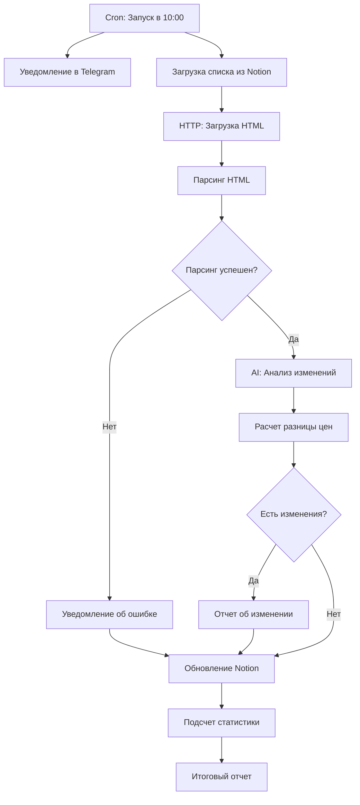

# 🚀 Инструкция по настройке агента мониторинга конкурентов

## 📋 Что было исправлено

### ✅ Критические исправления:

1. **Node 4 (Парсинг HTML)**
   - Исправлен доступ к данным HTTP Response: `item.json.data` вместо `item.json.response`
   - Добавлена обработка различных структур данных Notion
   - Улучшена обработка ошибок с подробными сообщениями
   - Добавлены множественные селекторы для поиска цены и описания

2. **Node 5-9 (Логика условий)**
   - Переработана логика IF-условий для правильного разветвления
   - Первая проверка: успешен ли парсинг?
   - Вторая проверка: есть ли важные изменения?

3. **Передача данных между нодами**
   - Исправлена передача данных из Anthropic в Code node
   - Добавлено объединение данных для корректной работы цепочки

4. **Новые ноды**
   - Node 12: Подсчет статистики по всем проверкам
   - Node 13: Итоговый отчет в Telegram со статистикой

5. **Соединения (Connections)**
   ```
   Старая схема (с ошибками):
   IF: Обнаружено изменение? 
     ├─ TRUE  → Node 9 (отчет)
     └─ FALSE → Node 10 (обновление Notion) ❌ НЕПРАВИЛЬНО
   
   Новая схема (исправлено):
   IF: Парсинг успешен?
     ├─ TRUE  → AI анализ → Расчет цен → IF: Есть изменение?
     │                                      ├─ TRUE  → Отчет об изменении → Обновление Notion
     │                                      └─ FALSE → Обновление Notion
     └─ FALSE → Уведомление об ошибке → Обновление Notion
   ```

---

## 🔧 Настройка агента

### Шаг 1: Переменные окружения (Environment Variables)

В n8n создайте следующие переменные:

```bash
TELEGRAM_CHAT_ID=<ваш_chat_id>
NOTION_DATABASE_ID=<id_вашей_базы_данных>
```

### Шаг 2: Учетные данные (Credentials)

Создайте следующие Credentials в n8n:

1. **Telegram API**
   - Name: `Telegram Account`
   - Access Token: получите от @BotFather

2. **Notion API**
   - Name: `Notion API`
   - API Key: создайте в Notion Settings → Integrations

3. **Anthropic API**
   - Name: `Anthropic API`
   - API Key: получите на https://console.anthropic.com/

### Шаг 3: Структура базы данных Notion

Создайте в Notion базу данных со следующими полями:

| Поле | Тип | Описание |
|------|-----|----------|
| **Name** (или "Название") | Title | Название тура конкурента |
| **URL конкурента** (или "URL") | URL | Ссылка на страницу тура |
| **Последняя цена** | Number | Цена при последней проверке |
| **Последний статус** | Text | Описание при последней проверке |
| **Дата проверки** | Date | Дата последней проверки |
| **Статус парсинга** | Text | Статус последней проверки (OK/Ошибка) |

### Шаг 4: Настройка CSS-селекторов

**⚠️ ВАЖНО!** Вам нужно настроить селекторы под сайты ваших конкурентов.

Откройте **Node 4: "Code: Парсинг и извлечение данных"** и найдите:

```javascript
// === ВАЖНО: НАСТРОЙТЕ СЕЛЕКТОРЫ ПОД ВАШИ САЙТЫ ===
const priceSelectors = [
  '.price',           // ← ЗАМЕНИТЕ НА РЕАЛЬНЫЕ
  '.tour-price',
  '[data-price]',
  '.price-value',
  'span.price',
  'div.price'
];

const descriptionSelectors = [
  '.description',     // ← ЗАМЕНИТЕ НА РЕАЛЬНЫЕ
  '.tour-description',
  '[data-description]',
  '.content',
  'article',
  '.tour-info'
];
```

#### Как найти правильные селекторы:

1. Откройте сайт конкурента в браузере
2. Нажмите F12 (DevTools)
3. Кликните на иконку "Выбрать элемент" (или Ctrl+Shift+C)
4. Наведите на цену или описание
5. В DevTools скопируйте CSS-селектор (ПКМ → Copy → Copy selector)
6. Вставьте в массив селекторов

**Пример:**
```javascript
// Если цена на сайте выглядит так:
// <span class="tour-price-value">85000 ₽</span>

const priceSelectors = [
  '.tour-price-value',  // Ваш селектор
  '.price',             // Запасные варианты
  '[data-price]'
];
```

---

## 📊 Логика работы агента



---

## 🧪 Тестирование

### 1. Ручной запуск
1. Откройте workflow в n8n
2. Нажмите **"Execute Workflow"**
3. Проверьте результаты в Telegram

### 2. Проверка парсинга
1. Запустите workflow
2. Если получили ошибку парсинга → настройте селекторы в Node 4
3. Проверьте, что данные сохраняются в Notion

### 3. Проверка уведомлений
Вы должны получить в Telegram:
- ✅ Уведомление о старте
- 💥 Отчеты об изменениях (если есть)
- 🚨 Ошибки парсинга (если есть)
- ✅ Итоговый отчет со статистикой

---

## 🎯 Пример работы

### Уведомление о старте:
```
✅ Агент Мониторинга Конкурентов запущен.
🕐 Время: 07.10.2025 10:00

Начинаю проверку сайтов конкурентов...
```

### Отчет об изменении:
```
💥 ВАЖНОЕ ИЗМЕНЕНИЕ У КОНКУРЕНТА!

📌 Тур: [Вулканы Камчатки - 7 дней](https://example.com/tour)

🤖 Анализ AI:
ЦЕНА ИЗМЕНИЛАСЬ: Снижена на 15000 руб с 85000 до 70000

💰 Сравнение цен:
📉 Снижение на 15000 ₽
• Было: 85000 ₽
• Стало: 70000 ₽
• Изменение: -17.65%

🕐 Проверено: 07.10.2025 10:05
```

### Итоговый отчет:
```
✅ МОНИТОРИНГ ЗАВЕРШЕН

📊 Статистика:
• Всего проверено: 12
• Найдено изменений: 3
• 📈 Цены выросли: 1
• 📉 Цены снизились: 2
• Без изменений: 9

🕐 Время: 07.10.2025 10:15

Следующая проверка: завтра в 10:00
```

---

## ⚙️ Расписание

Агент запускается автоматически:
- **Время:** каждый день в 10:00
- **Cron:** `0 10 * * *`

Чтобы изменить расписание, отредактируйте Node 0 (Cron).

---

## 🐛 Частые проблемы

### Ошибка: "Цена не найдена"
**Решение:** Обновите CSS-селекторы в Node 4

### Ошибка: "HTML не загружен"
**Решение:** 
- Проверьте, что URL в Notion правильный
- Возможно, сайт блокирует автоматические запросы
- Добавьте User-Agent в Node 3 (HTTP Request)

### Данные не обновляются в Notion
**Решение:**
- Проверьте, что поля в Notion называются точно так же
- Убедитесь, что у Notion API есть доступ к базе данных

---

## 📈 Улучшения (опционально)

1. **Добавить User-Agent** в Node 3:
```javascript
"headers": {
  "User-Agent": "Mozilla/5.0 (Windows NT 10.0; Win64; x64) AppleWebKit/537.36"
}
```

2. **Добавить прокси** для обхода блокировок

3. **Сохранять скриншоты** страниц с помощью Puppeteer

4. **Мониторить наличие туров** (sold out / available)

5. **Отслеживать отзывы** конкурентов

---

## 📞 Поддержка

Если у вас возникли вопросы:
1. Проверьте логи в n8n (Executions)
2. Убедитесь, что все Credentials настроены
3. Протестируйте каждую ноду отдельно

**Важно:** После первой проверки агент зафиксирует текущие данные. Изменения будут обнаруживаться при последующих запусках.

---

## ✅ Чеклист запуска

- [ ] Создана база данных в Notion с нужными полями
- [ ] Добавлены конкуренты с URL в Notion
- [ ] Настроены переменные окружения (TELEGRAM_CHAT_ID, NOTION_DATABASE_ID)
- [ ] Созданы Credentials (Telegram, Notion, Anthropic)
- [ ] Настроены CSS-селекторы в Node 4
- [ ] Выполнен тестовый запуск
- [ ] Проверены уведомления в Telegram
- [ ] Проверено обновление данных в Notion

Готово! 🎉