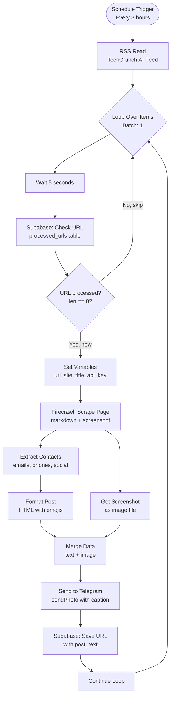
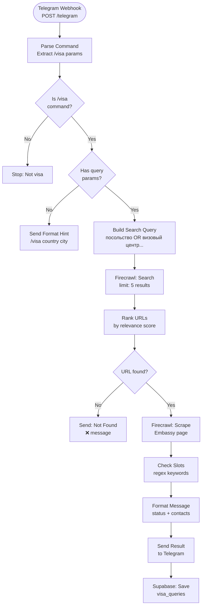
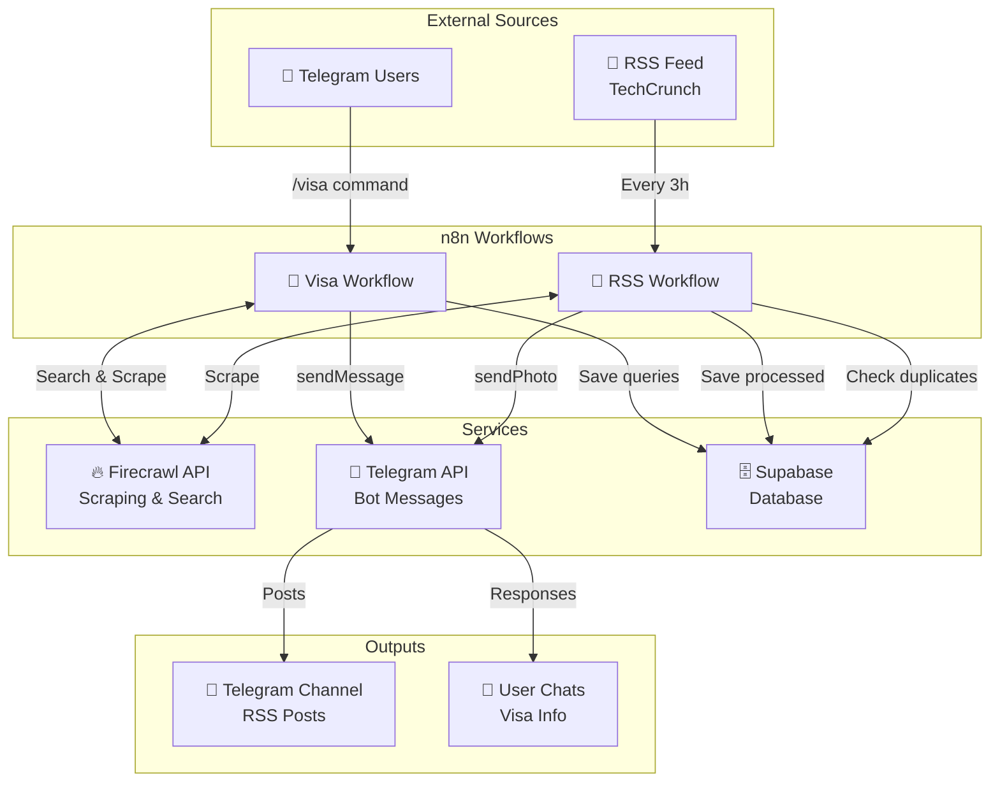
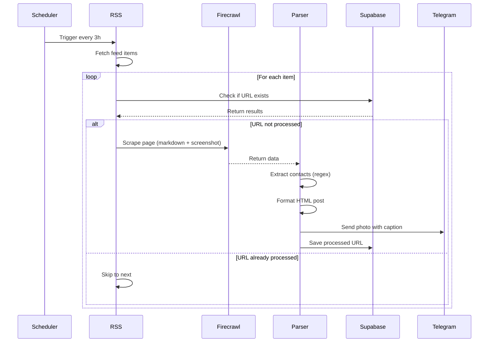
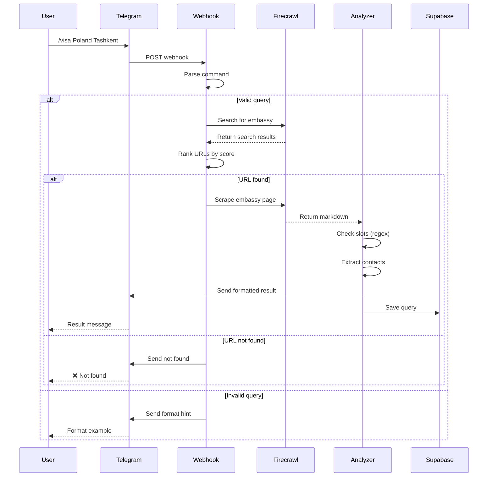
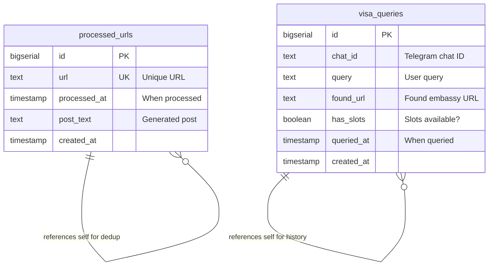
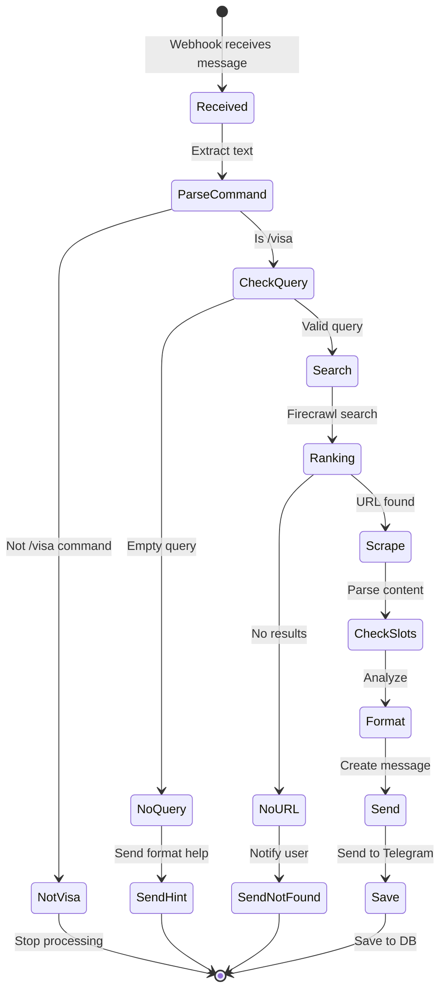
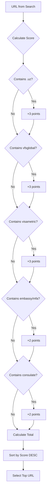

# Workflow Diagrams

## 🔄 RSS Processing Flow



## 📱 Visa Query Flow



## 🏗️ Complete System Architecture



## 🔐 Data Flow - RSS



## 🌍 Data Flow - Visa



## 📊 Database Schema



## 🎯 Node Connections Map

### RSS Workflow Nodes:
1. `Запуск по расписанию (RSS)` → `RSS Read`
2. `RSS Read` → `Loop Over Items`
3. `Loop Over Items` → `Wait`
4. `Wait` → `Supabase: Проверка обработанных`
5. `Supabase: Проверка обработанных` → `Если не обработан (len==0)`
6. `Если не обработан (len==0)` → TRUE → `Установка переменных`
7. `Если не обработан (len==0)` → FALSE → `Loop Over Items` (skip)
8. `Установка переменных` → `Firecrawl: Парсинг страницы`
9. `Firecrawl: Парсинг страницы` → `Извлечение контактов` & `Получить скриншот`
10. `Извлечение контактов` → `Создать пост (Форматирование)`
11. `Создать пост (Форматирование)` → `Объединение данных` (input 0)
12. `Получить скриншот` → `Объединение данных` (input 1)
13. `Объединение данных` → `Отправить в Telegram (RSS)`
14. `Отправить в Telegram (RSS)` → `Supabase: Сохранить обработанный`
15. `Supabase: Сохранить обработанный` → `Continue Loop`
16. `Continue Loop` → `Loop Over Items`

### Visa Workflow Nodes:
1. `Webhook /telegram` → `Определить команду /visa`
2. `Определить команду /visa` → `IF: не /visa → стоп`
3. `IF: не /visa → стоп` → TRUE → `Стоп: не /visa`
4. `IF: не /visa → стоп` → FALSE → `IF: есть query?`
5. `IF: есть query?` → FALSE → `Подсказка формата`
6. `IF: есть query?` → TRUE → `Сформировать поисковый запрос`
7. `Сформировать поисковый запрос` → `Firecrawl: Поиск посольств`
8. `Firecrawl: Поиск посольств` → `Выбрать лучший URL`
9. `Выбрать лучший URL` → `IF: найден URL?`
10. `IF: найден URL?` → FALSE → `Отправить: не найдено`
11. `IF: найден URL?` → TRUE → `Firecrawl: Страница посольства`
12. `Firecrawl: Страница посольства` → `Проверка наличия слотов`
13. `Проверка наличия слотов` → `Форматировать сообщение о визе`
14. `Форматировать сообщение о визе` → `Отправить результат о визе`
15. `Отправить результат о визе` → `Supabase: Сохранить запрос визы`

## 🔄 State Machine - Visa Query



## 📈 Performance Metrics

```mermaid
gantt
    title RSS Workflow Timeline (per item)
    dateFormat  s
    
    section Processing
    Wait (rate limit)           :0, 5s
    Supabase check             :5s, 1s
    Firecrawl scrape           :6s, 8s
    Extract contacts           :14s, 1s
    Format post                :15s, 1s
    Get screenshot             :6s, 3s
    Merge data                 :16s, 1s
    Send Telegram              :17s, 2s
    Save to Supabase           :19s, 1s
    
    section Total
    Total time per item        :0, 20s
```

## 🔍 Decision Tree - URL Ranking



---

## 📝 Legend

- 🔄 = Scheduled/Automated process
- 📱 = User-triggered process
- 🔥 = External API call (Firecrawl)
- 💬 = Telegram interaction
- 🗄️ = Database operation
- ✅ = Success path
- ❌ = Error/failure path
- 🔍 = Decision point
- 📊 = Data processing

---

**Note:** All diagrams are in Mermaid format and can be rendered in GitHub, GitLab, or any Markdown viewer that supports Mermaid.
